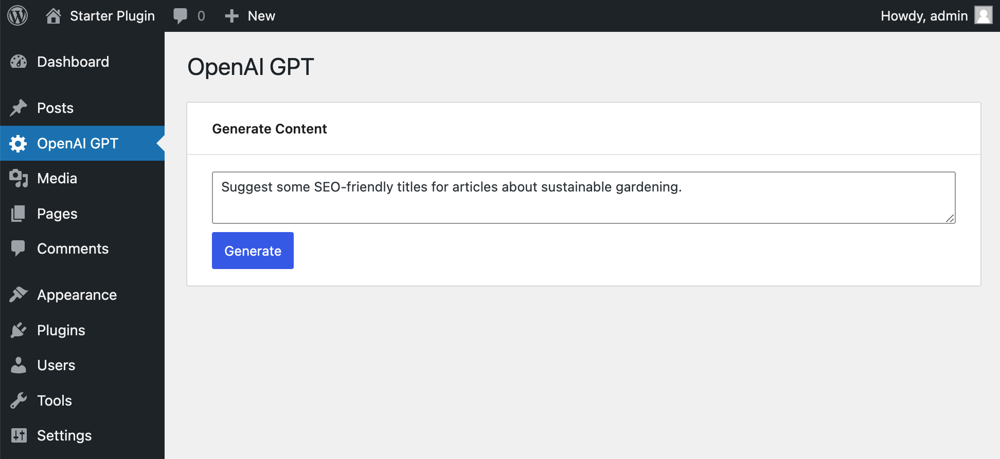
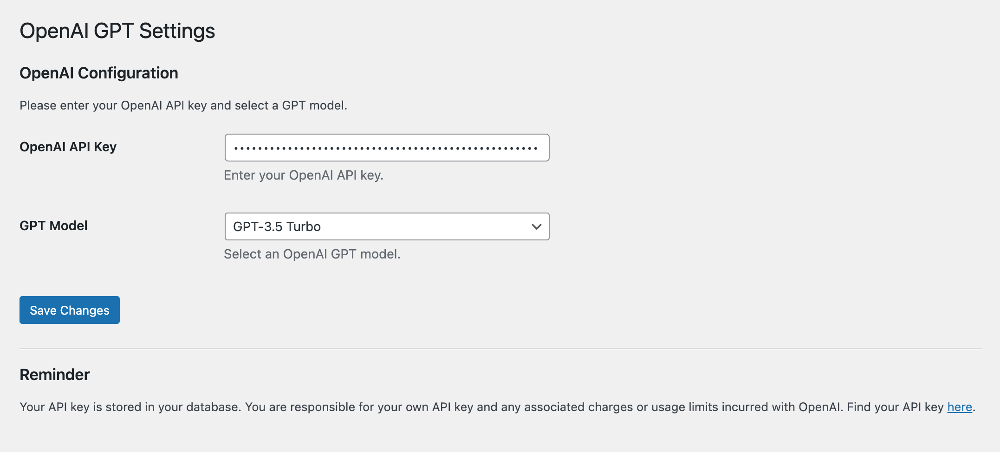

# Connect WordPress to OpenAI GPT - Starter Plugin

## Description

A starter plugin for connecting WordPress to OpenAI's API.





## Features

- **OpenAI API Integration**: Connect your WordPress site with OpenAI's text generation models.
- **Custom REST API Endpoint**: The plugin includes a custom REST API endpoint `/wpgpt/v1/completions` to interact with the OpenAI Chat Completions API.
- **Flexible Settings Page**: Configure your OpenAI API key and select between two GPT models: GPT-3.5 Turbo and GPT-4. Additional models can be added to the `settings-page.php` file.
- **Interactive Admin Page**: A React-based admin page where you can send requests to the custom endpoint and receive responses from the OpenAI API. The page is built using WP Scripts and WP Components, allowing for customization based on your requirements.
- **Translation Ready**: The plugin is prepared for translation, using the text domain "wpgpt" for all its strings.

## Installation

1. Download or clone the repository into your WordPress `plugins` directory.
2. Navigate to your WordPress admin dashboard and go to the Plugins section.
3. Locate 'WP GPT Starter Plugin' and activate it.

## Configuration

### Set Your OpenAI API Key

1. Navigate to the plugin's settings page in the WordPress admin area.
2. Enter your OpenAI API key in the provided field.
3. Select the desired GPT model from the dropdown menu.

### Add More Models

You can add more models by editing the `settings-page.php` file.

### Customize the AI Prompt

To customize the AI prompt to better suit your specific use case, follow these steps:

1. **Locate the AI Prompt**: 
   The AI prompt can be found in `includes/wpgpt-endpoint.php`, in the `openai_api` function. This function handles the OpenAI API request.

2. **Modify the System Message**: 
   To change the AI's system message, locate the following line:
   ```php
   ["role" => "system", "content" => "You are a helpful assistant."]
   ```
   This line sets up the initial context for the AI. You can modify the "content" part of this array to change the default behavior or context provided to the AI.

3. **Modify the Prompt Message**: 
   The user's message is captured and sent to the API with this line:
   ```php
   ["role" => "user", "content" => $userMessage]
   ```
   `$userMessage` is obtained from the request. You can prepend or append additional content to `$userMessage` if you want to provide more context or instructions to the AI.

## Using WP Scripts for Development

The admin page of this plugin is built using React and leverages WP Scripts for development and building processes.

### Getting Started with Development

1. Ensure you have Node.js installed on your system.
2. Navigate to the plugin's directory in your terminal.
3. Run `npm install` to install the necessary dependencies.

### Building the Project

- To build the project for production, run `npm run build`.
- For development purposes, you can use `npm start`.

## Interacting with the Custom REST API Endpoint

The plugin registers a custom REST API endpoint at `wpgpt/v1/completions`. You can interact with this endpoint to send requests and receive responses from the OpenAI Chat Completions API. The endpoint can be accessed only by users with admin privileges.

### Sending Requests

- Send a POST request to `yourdomain.com/wp-json/wpgpt/v1/completions` with the necessary payload.
- The payload for the request should be a JSON object containing a single key-value pair. The key is `prompt`, and its value should be the text prompt you want to process.
- The payload and response format follow the OpenAI API structure.

## Customizing the Admin Page

The admin page is built with React and WP Components. You can customize this page by editing the React components located in the `src/AdminPage.js`.

## Error Handling

The WP GPT Starter Plugin implements comprehensive error handling:

- **Handling of WordPress HTTP API Errors**: If the request to the OpenAI API fails at the WordPress level (e.g., network issues), the plugin captures and returns this as a `WP_Error`.

- **JSON Parsing Error Checks**: The plugin checks for and handles JSON parsing errors in the response from the OpenAI API, ensuring the response format is correct.

- **HTTP Status Code Monitoring**: If the HTTP status code of the API response is not 200 (OK), the plugin processes and returns the error, including any error messages from the OpenAI API for clarity.

- **Error Logging**: Errors are logged to the WordPress debug log if WP_DEBUG is enabled in your wp-config.php file.

### Customizing Error Responses

Developers can customize error responses based on the HTTP status by modifying the `wpgpt-endpoint.php` file. HTTP status codes are captured in the `$http_status` variable. 

## License

[GPLv2 or later](https://www.gnu.org/licenses/gpl-2.0.html)
